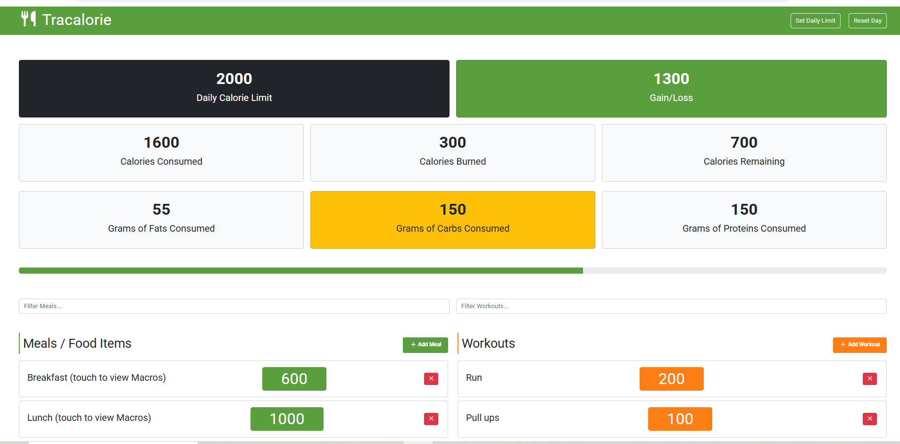

# Tracalorie

https://macroscalorietracker.netlify.app/

The Tracalorie is a front-end app to track Caloric intake, by calculating the difference between intake and expenditures based on physical exercises. The app also track macros in each meal i.e carbs, proteins and fats content of a meal. The browser local storage is used to save entries. The app is built using **ES Modules (ESM)** the modern, standardized JavaScript module system designed for both browsers and **CommonJS (CJS)** an older, Node.js-specific system that uses require() and module.exports for synchronous module loading. **Webpack** is used for module bundling purpose. **Babel** is the code transpiler used, **css-loader** and the **mini-css-extract** plugin for styling, and the **html-webpack-plugin**.**Bootsrtap** library is used for interactivity through its pre-built components like modals. Please check the devDependencies and dependencies sections of the package.json file for details on used versions.
To run this project locally, clone the repo and run npm i to install all dependencies, followed by npm run dev command in your CLI.
Note that we are using a webpack.config file for custom configuration such as rule setting, etc. This project is hosted on Netlify. Please follow the link for a live demo.

Thank you for visiting this repository. Feedbacks are welcome and can be emailed to bishimwe84@gmail.com.
